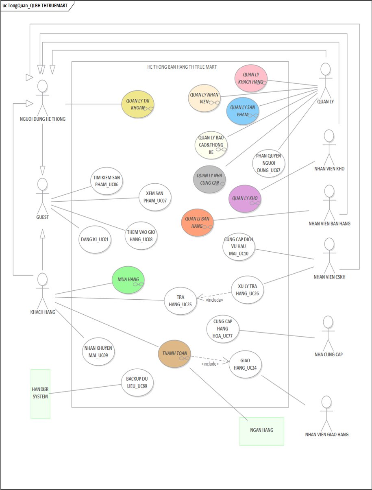
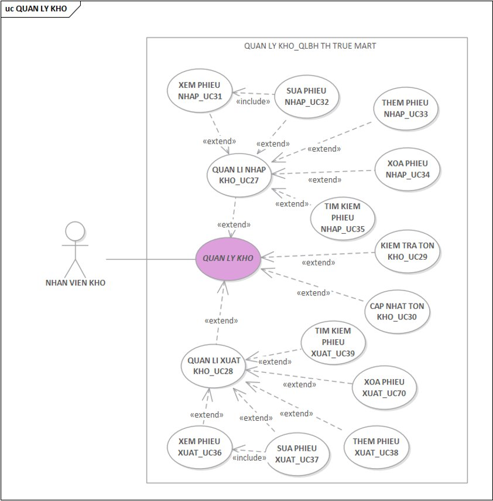
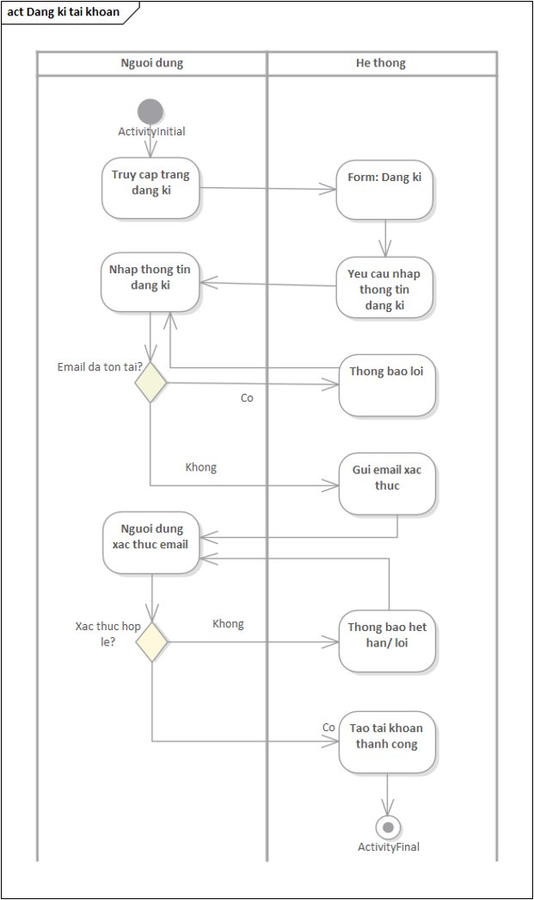
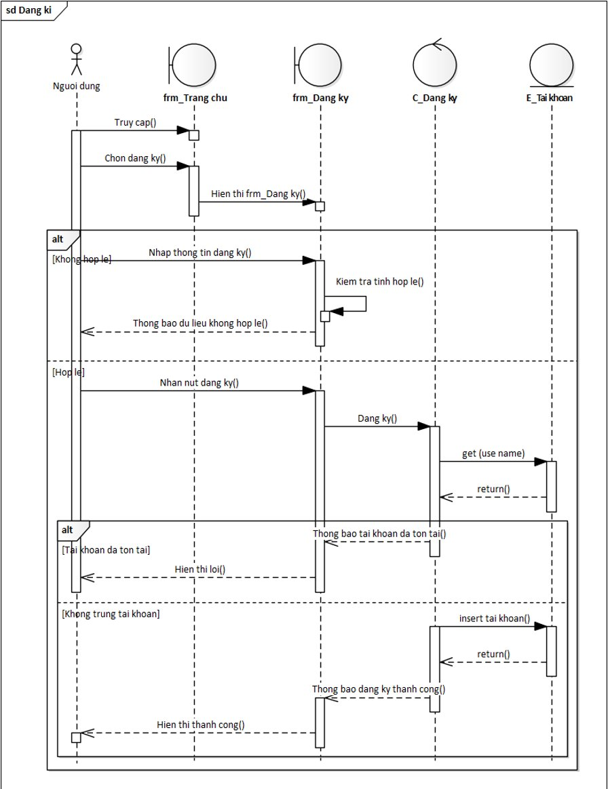
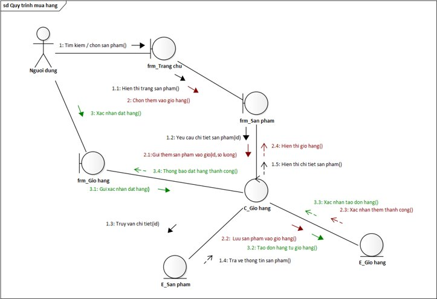
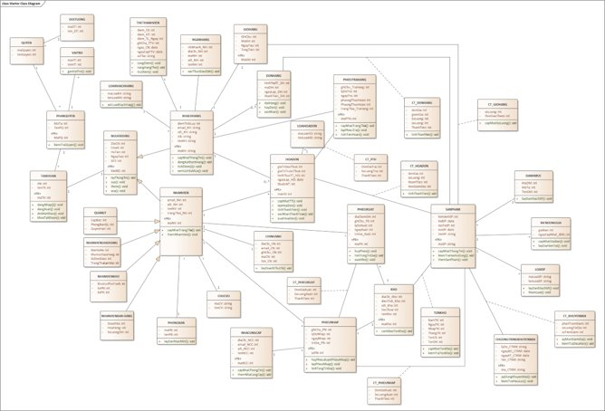
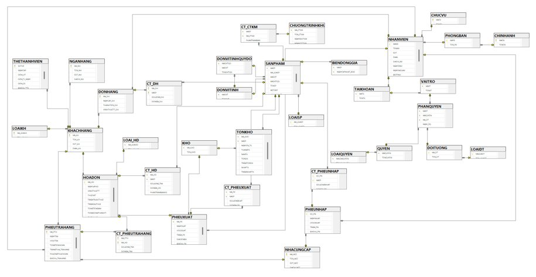
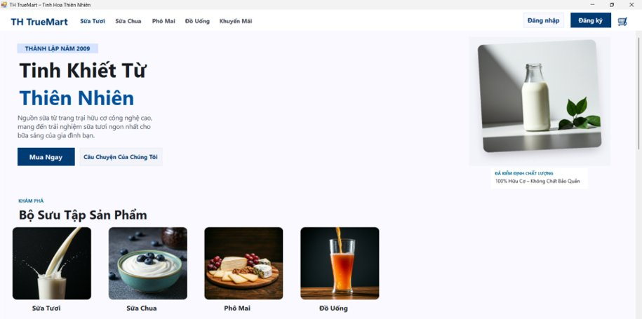
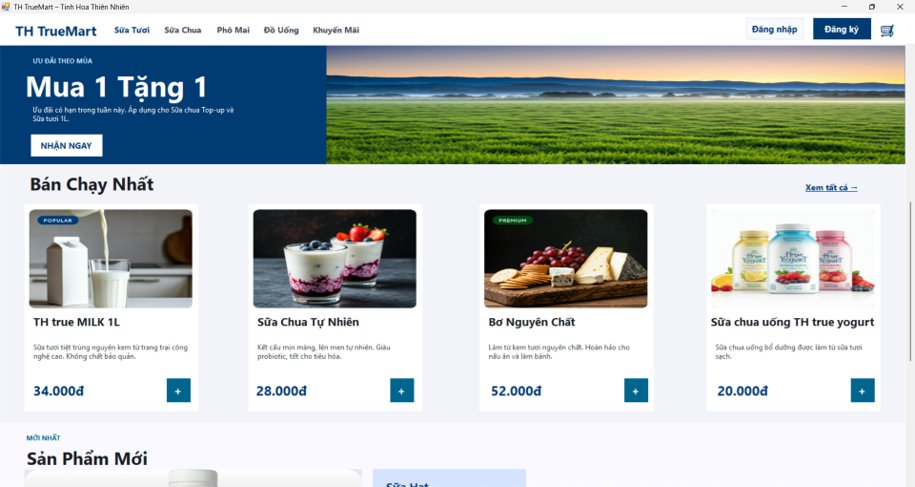
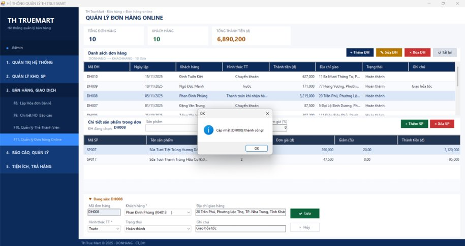

# TH TrueMart Sales Management System (Academic Case Study)

    

> **Academic course project** — Object-oriented analysis and design of a sales management system for TH TrueMart, a Vietnamese dairy retail chain. Covers business process modelling, full UML diagram suite (Use Case, Activity, Sequence, Collaboration, Class, State, Component, Deployment), 3-tier architecture design, and a functional Windows Forms application.

---

## Business Problem

TH TrueMart's manual sales operations create bottlenecks in order processing, inventory tracking, payment handling, and customer service. This project designs a structured online platform to digitalise and automate the full retail workflow — from product browsing and cart management to warehouse operations and reporting — integrating **nine actor groups** across **eight functional modules**.

---

## Functional Scope

| Module | Key Capabilities |
|---|---|
| Account Management | Registration, login/logout, forgot password, change password, role-based access |
| Product Search & Browsing | Keyword search, product detail view — available to guests without login |
| Cart & Ordering | Add/remove items, apply promotion codes, confirm order details |
| Payment | Online bank transfer, cash on delivery, payment verification, e-invoice export |
| Delivery | Order assignment, delivery status updates, customer confirmation |
| After-Sales Service | Return requests, return processing, customer care |
| Warehouse Management | Stock receipts, stock issues, inventory checks, stock updates |
| Reporting & Analytics | Import/export reports, consolidated reports, sales statistics |

---

## System Architecture

```
Presentation Layer   →  C# WinForms UI  (3-tier architecture per use case)
Business Logic Layer →  OOP service classes, business rules, validation
Data Access Layer    →  SQL Server — stored procedures, triggers, constraints
External Systems     →  Ngan Hang (payment) · Handler System (backup & restore)
```

---

## System Actors

| Actor | Role |
|---|---|
| **Guest** | Browse and search products — no login required |
| **Customer** | Place orders, pay, track status, request returns, receive promotions |
| **Sales Staff** | Process in-store transactions, issue invoices, manage orders |
| **Warehouse Staff** | Manage stock receipts and issues, update inventory levels |
| **Delivery Staff** | Accept and fulfil delivery orders, update delivery status |
| **Customer Service Staff** | Handle after-sales requests, process returns |
| **Manager** | Full administration — staff, products, warehouse, reports, permissions |
| **Bank** | Process online payments and confirm transactions |
| **Handler System** | Automated data backup every 24 hours |

---

## Use Case Summary

77 Use Cases specified with actors, preconditions, main/alternative flows, postconditions, and business rules.

| Group | Representative Use Cases |
|---|---|
| Account | UC01 Register · UC02 Login · UC04 Forgot Password · UC05 Change Password · UC67 Manage Permissions |
| Shopping | UC06 Search Product · UC07 View Product · UC08 Add to Cart · UC09 Receive Promotion · UC14 Place Order |
| Payment | UC19 Pay in Advance · UC20 Cash on Delivery · UC21 Process Payment · UC23 Bank Transfer · UC24 Delivery |
| Returns | UC25 Return Item · UC26 Process Return |
| Warehouse | UC27 Manage Stock Receipt · UC28 Manage Stock Issue · UC29 Check Inventory · UC30 Update Inventory |
| Reporting | UC59 Import Report · UC60 Export Report · UC61 Consolidated Report |
| Admin | UC45 Add Product · UC46 Update Product · UC69 Backup Data |

---

## OOP Analysis Artifacts

The project delivers a complete UML model built in **Enterprise Architect**:

- **Use Case Diagrams** — System overview + 6 detailed module diagrams
- **Activity Diagrams** — 10 key workflows (registration, ordering, payment, returns, warehouse intake/issue, etc.)
- **Sequence Diagrams** — 10 interaction flows with 3-tier layering (Form → Controller → Entity)
- **Collaboration Diagrams** — 10 object communication diagrams
- **Class Diagram** — Full domain model with attributes, methods, and relationships
- **State Diagram** — Order lifecycle state machine
- **Component Diagram** — Package structure across presentation, logic, and data layers
- **Deployment Diagram** — Physical node and component deployment

---

## Database Design

Fully normalised relational schema mapped from the class diagram. Key tables:

```
TAIKHOAN · KHACHHANG · NHANVIEN · CHUCVU · VAITRO · PHANQUYEN
SANPHAM · LOAISP · BIENDONGGIA
DONHANG · CT_DH · HOADON · CT_HD · PHIEUTRAHANG · CT_PHTRAHANG
KHO · TONKHO · PHIEUNHAP · CT_PHIEUNHAP · PHIEUXUAT · CT_PHIEUXUAT
NHACUNGCAP · NGANHANG · CHUONGTRINHHK · CT_CTKM
CHINHANH · PHONGBAN · LOAIKH · LOAIDT
```

**Key business rules**

- Inventory is updated automatically on stock receipt and issue
- Payment triggers delivery workflow; cash-on-delivery triggers after delivery confirmation
- Returns are only processed within the allowed return window
- Data backup runs every 24 hours via Handler System integration
- Each role group has strictly scoped access — no cross-role privilege escalation

---

## System Diagrams

**Use Case — System Overview**



**Use Case — Warehouse Management (Detail)**



**Activity Diagram — Registration Flow**



**Sequence Diagram — Registration**



**Sequence / Collaboration Diagram — Shopping Flow**



**Class Diagram**



**Entity Relationship Diagram (ERD)**



---

## Screenshots

**Customer Interface**

| Home — Product Catalogue | Promotions & Best Sellers |
|:---:|:---:|
|  |  |

**Administrator Interface**

| Online Order Management |
|:---:|
|  |

---

## Repository Structure

```
/src                          →  C# WinForms application source
/database
    THTrueMart.sql            →  Full SQL schema, tables, constraints, sample data
/docs
    Report.docx               →  Full project report
    usecase_overview.png      →  System-level Use Case diagram
    usecase_warehouse.png     →  Warehouse Use Case detail
    activity_register.png     →  Registration Activity diagram
    sequence_register.png     →  Registration Sequence diagram
    sequence_shopping.png     →  Shopping Collaboration diagram
    class_diagram.png         →  Full Class diagram
    erd.png                   →  Entity Relationship diagram
    ui_home1.png              →  Customer home screen
    ui_home2.png              →  Promotions & product listing
    ui_admin_orders.png       →  Admin order management screen
README.md
```

---

## Non-Functional Requirements

| Criterion | Requirement |
|---|---|
| Performance | Response time < 3 seconds under normal load |
| Security | Bcrypt password hashing · HTTPS · JWT session tokens · Strict role-based access control |
| Reliability | Uptime ≥ 99.5% · Automated backup every 24 hours via Handler System |
| Scalability | Modular architecture — new features addable without disrupting existing functions |
| Usability | Intuitive UI · Clear error messages · Responsive design for desktop and mobile |
| Maintainability | Layered codebase with comments · System logs · Maintenance windows ≤ 30 minutes |

---

## Project Info

| | |
|---|---|
| **Course** | Object-Oriented Analysis & Design — Class 2611101058804 |
| **Institution** | University of Finance – Marketing · Faculty of Data Science |
| **Completed** | April 2026 |

> *The TH TrueMart brand name is used solely for academic purposes.*
